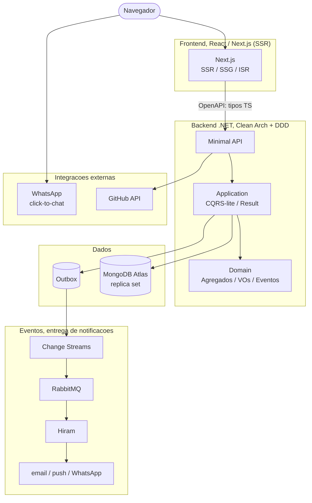

# Mapa técnico, Levante

Grafo de arquitetura + inventário de todas as propostas especuladas, com o estado de cada decisão.

Legenda de status: **Trav.** = travado (decidido) · **Rec.** = recomendado (default, não travado) · **Lic.** = armadilha de licença · **GAP** = decisão aberta.

---

## 1. Grafo de arquitetura (runtime + fluxo de eventos)

Leitura: o caminho síncrono (azul natural) vai do navegador ao Mongo passando por um contrato OpenAPI que gera os tipos do front. O caminho assíncrono nasce no Outbox (gravado na mesma transação do estado), o Change Stream faz o relay para o RabbitMQ, e o Hiram entrega. O site nunca chama provedor de notificação direto.

Cross-cutting que incide sobre Next.js + API e não aparecem como nó para não poluir o grafo: SEO, Analytics/LGPD, Identity/admin, Documents.

---

## 2. Inventário por camada

### Marca & produto
| Item | Status | Nota |
|------|--------|------|
| Levante | Trav. | nome do produto |
| Identidade maçônica oculta | Trav. | visual + desenvolvimento |
| Ecossistema Levante + Hiram | Trav. | |
| Convenção de nomes PT/EN | Trav. | substantivo PT + papel técnico EN |
| Design system "Trestleboard" | Rec. | |

### Frontend
| Item | Status | Nota |
|------|--------|------|
| React + Next.js | Trav. | decisão sua |
| SSR / SSG / ISR | Trav. | requisito de SEO |
| Sem SPA puro | Trav. | SPA não indexa conteúdo |
| Tailwind + shadcn/Radix | Rec. | recupera o gap de design system |
| OpenAPI → tipos TS | Rec. | NSwag / Kiota / openapi-typescript |

### Backend
| Item | Status | Nota |
|------|--------|------|
| .NET LTS (9/10) | Trav. | confirmar versão LTS |
| Minimal API | Trav. | |
| Clean Architecture | Trav. | |
| DDD + SOLID | Trav. | |
| CQRS-lite | Rec. | Commands / Queries |
| Result pattern | Rec. | exception só para falha de infra |
| FluentValidation | Rec. | no pipeline |
| Mapster | Rec. | evitar AutoMapper (licença) |
| Mediator | Trav. | GAP-F resolvido → sem lib (handler direto); Outbox hand-rolled, relay por reconciliação (ADR 0001) |

### Bounded contexts (domínio)
| Item | Status | Nota |
|------|--------|------|
| Conteudo | Trav. | artigos, notícias, publicações |
| Engajamento | Trav. | curtir, comentar, compartilhar |
| Audiencia | Trav. | leads, assinantes, consentimentos |
| Analytics | Trav. | telemetria |
| Identity | Trav. | admin, MFA |
| Documents | Trav. | PDF/Word, assinatura |
| Portfolio | Trav. | projetos, skills, GitHub |
| Integração (outbox) | Trav. | borda de eventos para o Hiram |

### Dados (MongoDB)
| Item | Status | Nota |
|------|--------|------|
| MongoDB Atlas | Rec. | GAP-E (vs self-host) |
| Replica set | Trav. | necessário p/ transações + Change Streams |
| Driver nativo + Repository | Rec. | repo por agregado |
| Collection time-series | Rec. | analytics |
| Atlas Search | Rec. | full-text |

### Integração & notificações (Hiram)
| Item | Status | Nota |
|------|--------|------|
| Outbox transacional | Trav. | |
| Relay por reconciliação (polling) | Trav. | robusto e à prova de failover; Change Streams = otimização futura de latência (ADR 0001) |
| RabbitMQ → Hiram | Trav. | |
| Integration events versionados | Rec. | |
| Contrato com Hiram | Rec. | GAP-I encaminhado: envelope provisório no exchange `levante.eventos` (ADR 0001) |

### SEO
| Item | Status | Nota |
|------|--------|------|
| SSR/SSG no conteúdo | Trav. | |
| JSON-LD Person + Article | Rec. | Person com sameAs LinkedIn/GitHub |
| Sitemap + RSS + canonical | Rec. | |
| Open Graph / Twitter cards | Rec. | |
| Core Web Vitals | Rec. | LCP/INP/CLS |
| Cross-post canonical | Rec. | LinkedIn/Medium apontando p/ o site |

### Analytics & LGPD
| Item | Status | Nota |
|------|--------|------|
| Coleta first-party | Rec. | dados seus |
| GeoIP | Rec. | MaxMind GeoLite2 |
| Anonimização de IP | Rec. | hash/truncar após geo |
| Banner de consentimento | Rec. | obrigatório LGPD |
| Política + retenção | Rec. | |
| Dashboard admin | Rec. | |

### Integrações externas
| Item | Status | Nota |
|------|--------|------|
| GitHub API | Rec. | repos, contribuições (GraphQL) |
| WhatsApp click-to-chat | Rec. | wa.me, custo zero (MVP) |
| WhatsApp Cloud API | GAP | GAP-G: só se quiser automação |
| Newsletter double opt-in | Rec. | LGPD + entregabilidade |

### Documentos & científico
| Item | Status | Nota |
|------|--------|------|
| QuestPDF | Lic. | Community grátis abaixo do limite, PDF |
| OpenXML | Rec. | Word |
| Nível de assinatura (1-4) | GAP | GAP-B: MVP 1-2, jurídico depois |
| Profundidade científica | GAP | GAP-C: template vs DOI/ORCID |
| DOI via Zenodo + ORCID | Rec. | grátis, integra com GitHub |

### Velocidade com Claude Code
| Item | Status | Nota |
|------|--------|------|
| CLAUDE.md (raiz + módulo) | Rec. | substitui repetir prompt |
| Slash commands | Rec. | /novo-slice, /review-seguranca |
| Subagents | Rec. | guardian-arquiteto, revisor-seguranca |
| Plan mode | Rec. | revisar plano custa menos que diff |
| Hooks Pre/PostToolUse | Rec. | format+test, bloquear arquivos sensíveis |
| Templates + source gen | Rec. | esqueleto fixo, menos variância |

### Qualidade & segurança (gates de CI)
| Item | Status | Nota |
|------|--------|------|
| Arch tests | Rec. | NetArchTest / ArchUnitNET |
| Analyzers | Rec. | Banned API, Sonar, Meziantou, Roslynator |
| Nullable + warnings as errors | Rec. | |
| CodeQL + gitleaks | Rec. | SAST + secret scanning |
| NuGet Audit + Dependabot | Rec. | CVE falha o build |
| Testes de isolamento multi-tenant | Rec. | blinda contra o cenário do EasyStok |
| Testcontainers + Shouldly | Rec. | Mongo real, não mock |
| rough-cut → dress → polish → raise | Rec. | sequência de gates |

### Infra & DevOps
| Item | Status | Nota |
|------|--------|------|
| VM conjunta (Docker Compose) | Trav. | GAP-J resolvido → VM com o Hiram (ADR 0003) |
| GitHub Actions | Rec. | CI/CD (imagens no GHCR + CD por SSH) |
| Docker Compose (stack conjunta) | Trav. | stack + provisioning no repo Hiram (ADR 0003) |
| OpenTelemetry (OTLP) → otel-lgtm | Trav. | observabilidade na VM (Tempo/Loki/Prometheus); App Insights só se voltar ao Azure |
| Serilog | Rec. | logs estruturados |
| Azure Front Door | Rec. | CDN, ajuda CWV |

---

## 3. GAPs abertos (decisões que travam o sequenciamento)

| GAP | Pergunta | Recomendação |
|-----|----------|--------------|
| D | Frontend | **Resolvido → React/Next.js** |
| H | Idiomas | **Reaberto → chrome bilíngue PT/EN, conteúdo de artigo continua PT-only, sem hreflang** (ver `docs/adr/0005-idioma-chrome-bilingue.md`) |
| J | Host | **Resolvido → VM conjunta com o Hiram (ADR 0003)** |
| A | Domínio (.dev) do site | **decisão do Felipe pendente — bloqueia a fatia de lançamento** (afeta SEO/schema/canonical/`SITE_URL`) |
| B | Nível de assinatura de documentos | MVP 1-2; jurídico só se necessário |
| C | Profundidade do modelo científico | template + DOI via Zenodo |
| E | MongoDB Atlas vs self-host | Atlas (replica set) |
| F | Mediator | **Resolvido → sem lib (handler direto); Outbox hand-rolled, relay por reconciliação** (Wolverine core virou MIT/grátis mas não adotado — muda o estilo e o outbox dele com Mongo é não-validado). Ver `docs/adr/0001`. |
| G | WhatsApp Cloud API | click-to-chat agora, Cloud API com automação |
| I | Contrato de eventos com Hiram | **Encaminhado → envelope provisório** (`docs/adr/0001`): JSON versionado no exchange `levante.eventos`; o Felipe alinha o Hiram. |

## 4. Armadilhas de licença mapeadas

| Pacote | Situação | Saída |
|--------|----------|-------|
| MediatR | comercial em versões novas | hand-rolled leve (adotado). Wolverine core voltou a ser MIT/grátis (jul/2025), mas não adotado |
| AutoMapper | comercial | Mapster / mapeamento manual |
| QuestPDF | Community grátis abaixo do limite de receita | manter sob o limite |
| FluentAssertions v8 | passou a ser paga | Shouldly / AwesomeAssertions / travar v7 |

---

Estado geral: 10 GAPs no total, 3 resolvidos (D frontend → React/Next.js, H idioma → chrome bilíngue PT/EN com conteúdo PT-only, J host → VM conjunta com o Hiram) e 7 abertos — sendo GAP-A (domínio) o único que bloqueia o lançamento, e GAP-F/GAP-I agendados para o spike da fatia do Outbox. 4 armadilhas de licença mapeadas com saída. O núcleo arquitetural (Clean Arch, DDD, contextos, outbox → Hiram, React/Next.js + .NET) está travado; o que falta é decisão pontual de ferramenta e escopo. O sequenciamento das fatias está em `docs/roadmap.md`.
